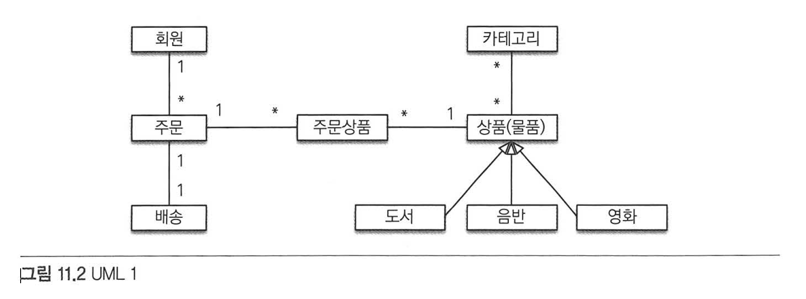
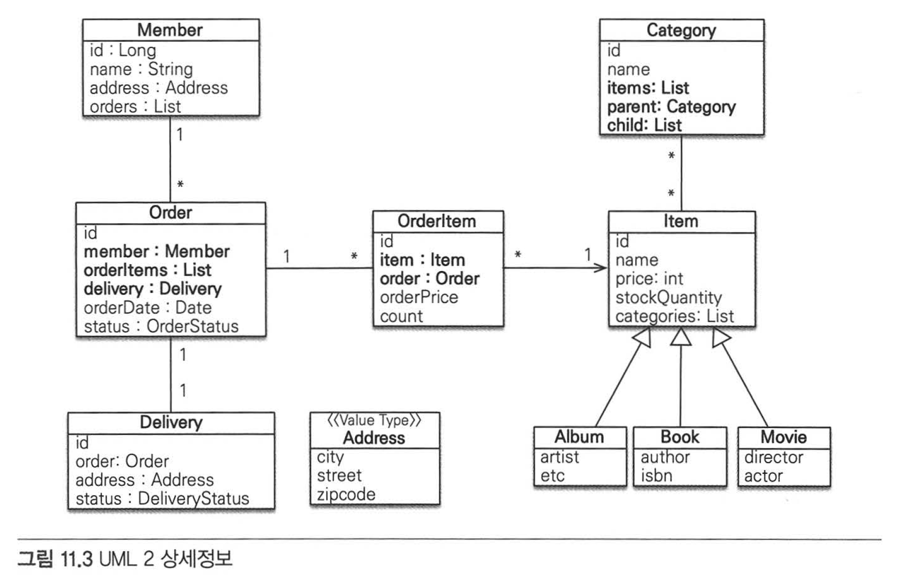
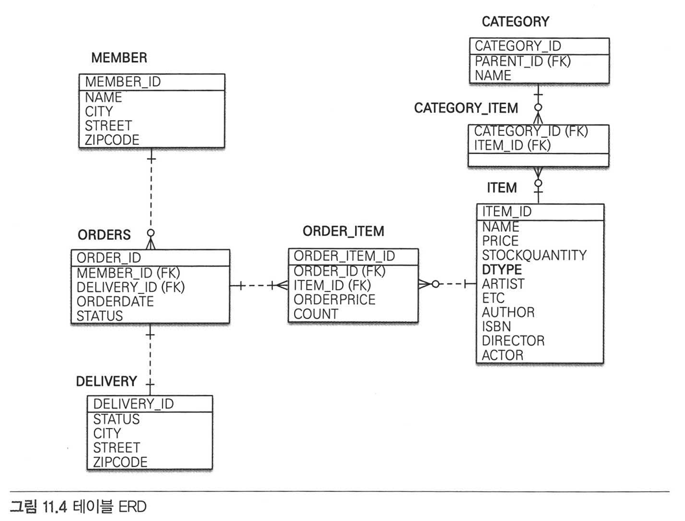
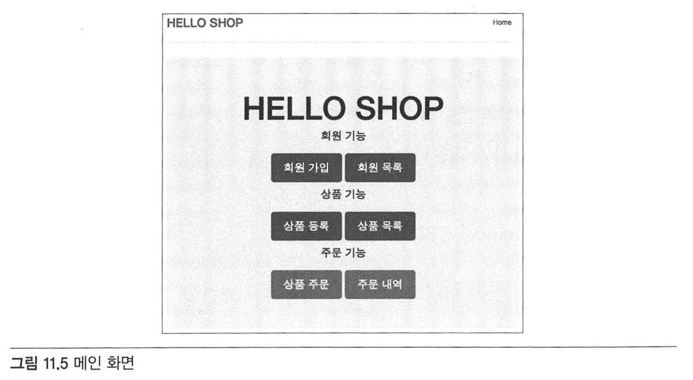

# Chapter 11 "웹 애플리케이션 제작"

---
## 11.1 프로젝트 환경설정

    설치 참고 : https://medium.com/@oopchoi/jpa-%ED%94%84%EB%A1%9C%EA%B7%B8%EB%9E%98%EB%B0%8D-fc443b647ec8  

  1. IntelliJ 프로젝트 환경설정   
    1) new - project from version control - https://github.com/holyeye/jpabook
    2) file - project structure - SDK : 1.8, Language Level : 8
    3) maven updates


  2. H2 데이터베이스 로컬 서버 구동
    1) week02 에서 실습한 것 참고하여 H2 구동 (윈도우 : h2 실행)
       (server 실행 안될 경우 https://www.inflearn.com/questions/271461/io-exception-null-90028-200-90028-90028-%EC%98%A4%EB%A5%98) + persistence.xml 과 URL 일치시켜주기  


  3. 프로젝트 실행
    1) ch11-jpa-shop OPEN
    2) tomcat 7 로 run test (윈도우+인텔리제이 커뮤니티 = 톰캣 지원X -> 플러그인 smart tomcat 설치)

    
  484p
  하이버네이트 속성 설정 (appConfig.xml)
  - hibernate.dialect : 사용할 데이터베이스 방언 설정. 여기서는 H2 데이터 베이스.
  - hibernate.show_sql : 실행 sql을 콘솔에 출력.
  - hibernate.format_sql : sql을 보기좋게 정리해서 출력.
  - hibernate.use_sql_comments : sql을 출력할 때 어떻게 실행된 sql인지 또는 사용자가 설정한 코멘트 남김.
  - hibernate.id.new_generator_mappings : JPA에 맞춘 새로운 ID 생성방법을 사용함. 하이버네이트 레거시 운영하는 것이 아니면 항상 true 로 설정.
  - hibernate.hbm2ddl.auto : 애플리케이션이 시작될 때 테이블과 기타 DDL을 자동으로 생성.  
      옵션 1) create : 기존 DDL을 제거하고 새로 생성.  
      옵션 2) create-drop : create와 동일하나, 애플리케이션 종료시 생성한 DDL 제거.  
      옵션 3) update : 현재 데이터베이스 DDL과 비교하여 변경사항만 수정.  
      옵션 4) validate : 현재 엔티티 매핑 정보와 데이터베이스 스키마가 같은지 비교하여, 다르면 경고를 남기고 애플리케이션 실행하지 않음. (DDL변경하지 않는 옵션)  

---

## 11.2 도메인 모델과 테이블 설계

### 11.2.1 요구사항 분석


### 11.2.2 도메인 모델 설계

  
  - 회원은 여러 상품 주문 가능
  - 다대다 관계는 사용하기 어려우므로 주문상품 엔티티 추가하여 다대다 관계를 일대다, 다대일 관계로 풀어냄.
  <br><br>

  

  - 회원 : 이름과 주문한 상품, 임베디드 타입인 Address를 가짐.
  - 주문 : 주문과 주문 상품은 일대다. 주문은 회원과 배송정보, 주문날짜, 주문상태를 가지고 있음. 주문상태는 열거형을 사용했는데, '주문'/'취소'를 표현할 수 있음.
  - 주문상품 : 주문한 상품정보와 주문금액, 주문 수량 등 정보를 가지고 있음.
  - 상품 : 이름, 가격, 재고수량을 가짐. 
  - 배송 : 주문시 하나의 배송정보를 생성. 주문과 배송은 일대일 관계.
    <br><br>


### 11.2.3 테이블 설계

  

  - MEMBER 테이블 : 회원 엔티티의 Address 임베디드 타입 정보가 그대로 들어감. (DELIVERY 테이블도 동일)
  - ITEM 테이블 : 앨범, 도서, 영화 타입을 통합하여 하나의 테이블로 만듦. DTYPE 컬럼을 추가하여 타입을 구분.
    <br><br>

### 11.2.4 연관관계 정리

  - 회원 <-> 주문 : 일대다 양방향 관계. 연관관계의 주인은 외래키가 있는 주문이 연관관계의 주인. Order.member를 ORDERS.MEMBER_ID 외래 키와 매핑.
  - 주문 <-> 주문상품 : 다대일 양방향 관계. 주문상품이 연관관계의 주인. OrderItem.order를 ORDER_ITEM.ORDER_ID 외래 키와 매핑.
  - 주문상품 <-> 상품 : 다대일 양방향 관계. OrderItem.item을 ORDER_ITEM.ITEM_ID 외래 키와 매핑.
  - 주문 <-> 배송 : 일대일 양방향 관계. Order.delivery를 ORDERS.DELIVERY_ID 외래키와 매핑.
  - 카테고리 <-> 상품 : @ManyToMany를 사용해서 매핑. (실무에서 잘 사용하지 않지만 예제용으로 추가.)
    <br><br>

### 11.2.5 엔티티 클래스

  - 예제 11.14 회원 엔티티  
    **@See** <U>Member.java</U>  
    

  - 예제 11.15 주문 엔티티  
    **@See** <U>Order.java</U>  
  

  - 예제 11.16 주문상품 엔티티  
    **@See** <U>OrderItem.java</U>  

  
  - 예제 11.17 상품 엔티티  
    **@See** <U>Item.java</U>  

  
  - 예제 11.18 상품-도서 엔티티  
    **@See** <U>Book.java</U>  

  
  - 예제 11.19 상품-음반 엔티티  
    **@See** <U>Album.java</U>  

  
  - 예제 11.20 상품-영화 엔티티  
    **@See** <U>Movie.java</U>  

  
  - 예제 11.21 배송 엔티티  
    **@See** <U>Delivery.java</U>  

  
  - 예제 11.22 카테고리 엔티티  
    **@See** <U>Category.java</U>  
  

  - 예제 11.23 주소 값 타입  
    **@See** <U>Address.java</U>  
    
---

## 11.3 애플리케이션 구현



### 회원기능
  - 회원 등록
  - 회원 목록 조회

### 상품 기능
  - 상품 등록
  - 상품 목록 조회
  - 상품 수정

### 주문 기능
  - 상품 주문
  - 주문 내역 조회
  - 주문 취소
  <br><br>


### 11.3.1 개발 방법

  
  <br><br>

### 11.3.2 회원 기능
  
  - 회원 등록
  - 회원 목록 조회
  <br><br>
  

  - **1) 회원 리포지토리 분석**

    예제 11.25 회원 리포지토리 코드  
    **@See** <U>MemberRepository.java</U>  
      <br>
    - @Repository 어노테이션이 붙어 있으면 \<context:component-scan> 에 의해 스프링 빈으로 자동 등록됨.  
      JPA 전용 예외가 발생하면 스프링이 추상화한 예외로 변환해줌.  
      서비스 계층은 JPA에 의존적인 예외를 처리하지 않아도 됨. (15장 참고)
      <br><br>
    - @PersistenceContext  
      스프링이나 J2EE 컨테이너를 사용하면 컨테이너가 엔티티 매니저를 관리하고 제공해줌.
      엔티티 매니저 팩토리에서 엔티티 매니저를 직접 생성해서 사용하는 것이 아니라 컨테이너가 제공하는 엔티티 매니저를 사용해야 함.  
      @PersistenceContext는 컨테이너가 관리하는 엔티티 매니저를 주입하는 어노테이션.  
      이렇게 엔티티 매니저를 컨테이너로부터 주입 받아서 사용해야 컨테이너가 제공하는 트랜잭션 기능과 연계해서 컨테이너의 다양한 기능들을 사용할 수 있음. (13장 참고)
      <br><br>
    - @PersistenceUnit  
      @PersistenceContext를 사용해서 컨테이너가 관리하는 엔티티 매니저를 주입받을 수 있어서 엔티티 매니저 팩토리를 직접 사용할 일은 거의 없지만,  
      엔티티 매니저 팩토리를 주입받으려면 @PersistenceUnit 어노테이션을 사용.
      <br><br>


  - **2) 회원 서비스 분석**

    예제 11.26 회원 서비스 코드  
    **@See** <U>MemberService.java</U>
      <br>
    - @Service : 이 어노테이션이 붙어있는 클래스는 \<context:component-scan> 에 의해 스프링 빈으로 자동 등록됨.
      <br><br>
    - @Transactional : 스프링 프레임워크는 이 어노테이션이 붙어 있는 클래스나 메소드에 트랜잭션을 적용함.  
      외부에서 이 클래스의 메소드를 호출할 때 트랜잭션을 시작하고, 메소드를 종료할 때 트랜잭션을 커밋. 예외가 발생하면 트랜잭션을 롤백.
      <br><br>
    - @Autowired : 스프링 컨테이너가 적절한 스프링 빈을 주입해줌. 여기서는 회원 레포지토리를 주입.
      <br><br>


  - **3) 회원 가입**  

    예제 11.27 회원가입  
    **@See** <U>MemberService.java</U>  

    ``` java
    /**
     * 회원 가입
     */
    public Long join(Member member) {
        validateDuplicateMember(member); //중복 회원 검증
        memberRepository.save(member);
        return member.getId();
    }

    private void validateDuplicateMember(Member member) {
        List<Member> findMembers = memberRepository.findByName(member.getName());
        if (!findMembers.isEmpty()) {
            throw new IllegalStateException("이미 존재하는 회원입니다.");
        }
    }
    ```
    <br>

  - **4) 회원 기능 테스트**  
  
    예제 11.28 회원가입 테스트 코드  
    **@See** <U>MemberServiceTest.java</U>
    <br><br>


### 11.3.3 상품 기능

  - 상품 등록
  - 상품 목록 조회
  - 상품 수정
    <br><br>


  - **1) 상품 엔티티 분석**  
    예제 11.30 상품 엔티티 코드  
    **@See** <U>Item.java</U>  
    <br>

  - **2) 상품 리포지토리 분석**
    예제 11.31 상품리포지토리 코드  
    **@See** <U>ItemRepository.java</U>  

    - save() 메소드 하나로 저장과 수정을 다 처리함.  
      식별자 값이 없으면 새로운 엔티티로 판단해서 persist()로 영속화하고  
      만약 식별자값이 있으면 이미 한 번 영속화 되었던 엔티티로 판단해서 merge()로 수정.  
      클라이언트는 저장과 수정을 구분하지 않아도 되므로 로직이 단순해짐.  
      영속 상태의 엔티티는 변경 감지(dirty checking) 기능이 동작해서 트랜잭션을 커밋할 때 자동으로 수정되므로 별도의 수정 메소드가 필요 없음.  
    <br>

  - **3) 상품 서비스 분석**
    예제 11.32 상품 서비스 코드  
    **@See** <U>ItemService.java</U>  
    <br>


### 11.3.4 주문 기능


### 11.3.5 웹 계층 구현


